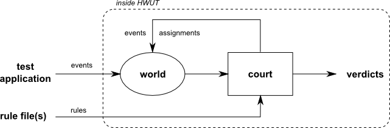

Temporal Logic
==============

Temporal logic is crucially different from 'classic' HWUT testing where test
output is compared to nominal output. It falls into the domain of formal
verification [ref]. That means that the correctness of the unit under test is
determined based on a formal description of its nominal behavior. In particular
temporal logic considers the influence of time and relative occurrence of
events. In that manner, rules can be expressed such as "when x is received,
then a list of y elements must be accumulated before z occurs".

HWUT provides its own little flavor of temporal logic that aims elegant
expressions of practical problems. The elements of temporal logic are specified
in a scripting language. The language and its ideas are explained in the
subsequent sections.

The Very Basics
###############

There are two players: The tested application and HWUT as an observer.
Accordingly there are 'events' sent by the application and 'rules' considered
by the observer. During the execution of a test, the application sends 'events'
(prints them on the standard output) to the observer.  The observer judges
the correctness based on a given set of rules. This is shown in figure [ref].

The only way for the test application to communicate with the HWUT observer is
through the events which it sends. Those events document the happenings during
the test. Those events change the internal representation of the 'world', i.e.
the configuration of all state variables. It keeps track of all events, and
when they occurred. Also it can maintain additional variables, but they are
modified by the 'court'.  The observer's court judges the correctness of what
is happening based on the internal representation of the world. It requires
rules to be specified in order to derive verdicts and possibly actively change
settings of the world.

.. admonition:: Event
   
   An event is a message from the test application to the observer about
   something that has happend during the test.

.. admonition:: World

   HWUT's world is a representation of the outside world based on events
   which are received from the test application. It contains information
   about events and auxiliary variables. 

The following shows a typical list of events sent by a test application.::

    ...
    START;
    BOOT(vga="ext", acpi="off", maxcpus=4);
    INETD("192.168.10.1", "255.255.255.0", 32);
    ...

Those events printed as strings are then interpreted by HWUT's observer. HWUT
registers that the ``START`` event has occurred. Then the ``BOOT`` event. 
It stores the information about ``vga``, ``acpi`` and ``maxcpus`` as side
information about that event, and so on. All this information is stored in the
internal representation of the 'world'.

.. epigraph::

     *The when, the where, and what happend ...*
         *the only way to catch the scent*
     *is by event.*

The observer requires rules to judge correctness. Whenever the state of the 
world changes it can apply rules to it. Those rules can be *active*, in the sense
that they change the world's state. Or, they are *passive*, in the sense that 
they only produce verdicts of correctness. 

.. epigraph::

     *Events change how one views the world.*
         *Even when things get strangely swirled*
     *we judge correctness by a tool*
         *called rule.*

Rules are defined in the HWUT-specific language called 'Joy'. A simple form of
a rule set is the following.::
 
    INETD.time() - BOOT.time() < 20; 
    
It tells that the ``INETD`` event has to happen not more than '20' time units
after the event ``BOOT``. Time is a unit-less entity in HWUT. It can be 
configured to be seconds, milliseconds, message numbers, or whatsoever. The
only requirement is that time must be monotonously increasing. Rules can 
be awake and asleep. The above rule is defined in a way that it is always
awake. But the awake and sleep state of rules can be controlled. There
will be more about this later. 

.. admonition:: Rule

    A rule defines a condition on the state variables of the world.  It can be
    *awake* or *asleep* (never both). It can be *passive* or *active*.  

    A passive rule may only produce verdicts. An active rule may change 
    variables of the world.

    A sleeping rule does not produce verdicts and it does not change
    the world.  

.. admonition:: Court

    A court is an engine based on a formal description of the nominal
    behavior. The court controls the *awake* and *sleep* state of rules. 
    It applies all awake rules to the world.

With events and rules, the world and the court, we can defined the failure and
the success of a test. 

.. admonition:: Test Failure

   A temporal logic test fails as soon as the court produces a failure
   verdict. That is, a failure means that an awake rule is broken.

As a consequence, a test *succeeds* if it terminates without braking any rule
that is awake. For practical testing, the temporal logic engine is activated by
the response option ``LOGIC:`` followed by a comma separated list of file names
which contain the rule set for the test.  For example, in javascript (node.js)
the response to ``--hwut-info`` might look like the following.

.. code-block:: javascript

    process.argv.forEach(function(value, index, array) {
        if( value == "--hwut-info" ) {
            console.log("My State Machine;");
            console.log("LOGIC: general.tlr, database-consistency.tlr;");
            process.exit(0);
        }
    })

The subsequent sections explain in detail how events are formatted and how
rules need to be specified. The temporal logic engine relies on its own
scripting language. Its syntax and data structures are described along with the
concepts that you use in your test specification.  In parallel to the
explanation a fully functional temporal logic test is implemented to be applied
in Perl and C. The tests applications can be foud in ``demo/Perl/logic/TEST``
or respectively ``dome/C/logic/TEST``.

The Example
###########

As an example, a tiny module is tested. It contains a state machine which
describes the behavior of 'TheDude'. 

.. code-block:: perl

    package TheDude;

    %behavior = (
        BED  => { tired => "BED",  buzz => "HOME" },
        HOME => { tired => "BED",  buzz => "WORK" },
        WORK => { tired => "HOME", buzz => "HOME" }
    );

    sub new {
        return { state => "BED", need_for_sleep => 5, work_time => 0 };
    }

    ...

TheDude is an object with a state, a certain need for sleep, and an amount of
work time that he has worked without interuption. Its state can either be in
``BED``, at ``HOME``, or at ``WORK``. The ``behavior`` describes how TheDude
reacts on the two events ``tired`` (TheDude gets tired) and ``buzz`` (TheDude
gets buzzed). A new dude is created with the ``TheDude::new()`` function.

.. code-block:: perl

    ...
    sub on_tired { 
        my ($dude) = @_;

        $dude->{state} = %{$behavior{$dude->{state}}}->{tired}; 
    }

    sub on_buzz { 
        my ($dude) = @_;

        $before        = $dude->{"state"};
        $dude->{state} = %{$behavior{$dude->{state}}}->{buzz}; 
        if( $before == "BED" && $dude->{need_for_sleep} < 0 ) {
            $dude->{need_for_sleep} = 0;
        }
    }
    ...

Two functions control TheDude's reaction to the events ``tired`` and ``buzz``.
``on_tired`` solely searches for the current state in ``behavior`` and sets the
subsequent state as specified in member ``tired``. The function ``on_buzz``
does the same thing for the behavior related to ``buzz``. Additionally, it
makes sure that the need for sleep is never negative when TheDude wakes up.
TheDude may have slept not enough (need for sleep > 0), but if he slept too
much (need for sleep < 0) then he does not profit from it.  Finally, there is
time. Each time an hour passed, TheDude's data needs to be updated by a call to
``on_clock``. 

.. code-block:: perl

    ...
    sub on_clock {
    # Performs TheDude's state change upon one hour increment. When the 'need for 
    # sleep' limit is exceeded, the 'on_tired' event handler is called. 'on_buzz'
    # is called at dedicated hours and in case that TheDude slept too much.
    #
    # RETURNS: 1 -- if a buzz event occured.
    #          0 -- else.
        my ($dude, $time) = @_;

        $hour = $time % 24;   
        $dude->{need_for_sleep} += 1   if( $dude->{state} eq "WORK" );
        $dude->{need_for_sleep} += 0.5 if( $dude->{state} eq "HOME" );
        $dude->{need_for_sleep} -= 1   if( $dude->{state} eq "BED" );
        $dude->{work_time} += 1        if( $dude->{state} eq "WORK" );
        $dude->{work_time} = 0         if( not $dude->{state} eq "WORK" );

        if( $dude->{need_for_sleep} > 11 ) {
            on_tired($dude);
        }
        if( $hour == 6 || $hour == 7 || $hour == 16 || $dude->{need_for_sleep} < -3 ) { 
            on_buzz($dude);
            return 1;
        }
        return 0;
    }

    1; # <The End> Perl modules like to have that '1' here. 

The fragment above says that the need for sleep increases twice as much at work
as it increases at home. Each hour that TheDude sleeps gains him 2 sleep points. 
When TheDude is at work the work hours are increment. Beyond his time at work the
work hours are zero. 

The ``tired`` event is related to a need for sleep value greater than 26. TheDude
is ``buzz``-ed at 6am, 7am, and 4pm (16:00 hours), or when he slept much more than he
needs to (need for sleep < -6).

The counterpart to TheDude in Perl, written in C, looks like the following. 

.. code-block:: cpp

    typedef enum {
        BED = 0, HOME = 1, WORK = 2,
    } StateId;

    typedef enum {
        BED = 0, HOME = 1, WORK = 2,
    } Event;

    typedef struct {
        StateId tired; // State to be entered upon ``tired`` 
        StateId buzz;  // State to be entered upon ``buzz``  
    } State;

    State behavior[3]= (
        { BED,  HOME },
        { BED,  WORK },
        { HOME, HOME }
    );

    typedef struct {
        state_t  state;
        float    need_for_sleep;
        int      work_time;
    } TheDude;

    void TheDude_init(TheDude* me) 
    {
        me->state_id       = BED;
        me->need_for_sleep = 5;
        me->work_time      = 0;
    }

    void on_tired(TheDude* me) 
    {
        me->state_id = behavior[me->state_id][TIRED];
    }

    void on_buzz(TheDude* me) 
    { 
        StateId before = me->state_id;
        me->state_id = behavior[me->state_id][BUZZ];

        if(   not (before != me->state_id ) && before == BED
           && me->need_for_sleep < 0 ) {
            me->need_for_sleep = 0;
        }
    }

    void on_clock(TheDude* me, int time) 
    {
        int hour = time % 24;   

        switch( me->state_id ) {
        case BED:  me->need_for_sleep -= 1;   me->work_time  = 0; break;
        case HOME: me->need_for_sleep += 0.5; me->work_time  = 0; break;
        case WORK: me->need_for_sleep += 1;   me->work_time += 1; break;
        }

        if( me->need_for_sleep > 11 ) {
            on_tired(me);
        }
        if( hour == 6 || hour == 7 || hour == 16 || me->need_for_sleep < -3 ) {
            on_buzz(me);
        }  
    }

For the further dicussion it is assumed that TheDude.pm contains the module described
in the example. 

.. toctree::
   :maxdepth: 3

   events/intro.rst
   the_world.rst
   rules/intro.rst
   rules/constraints.rst

..
   rules/assignments.rst
   rules/formal.rst
   rules/implicit.rst
   rules/temporal.rst
